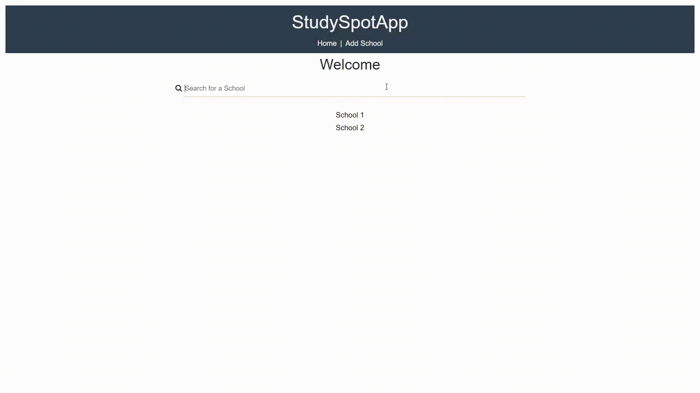
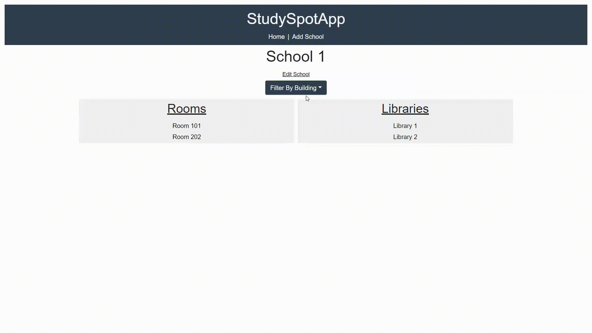
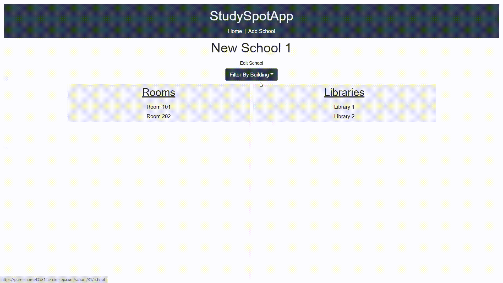
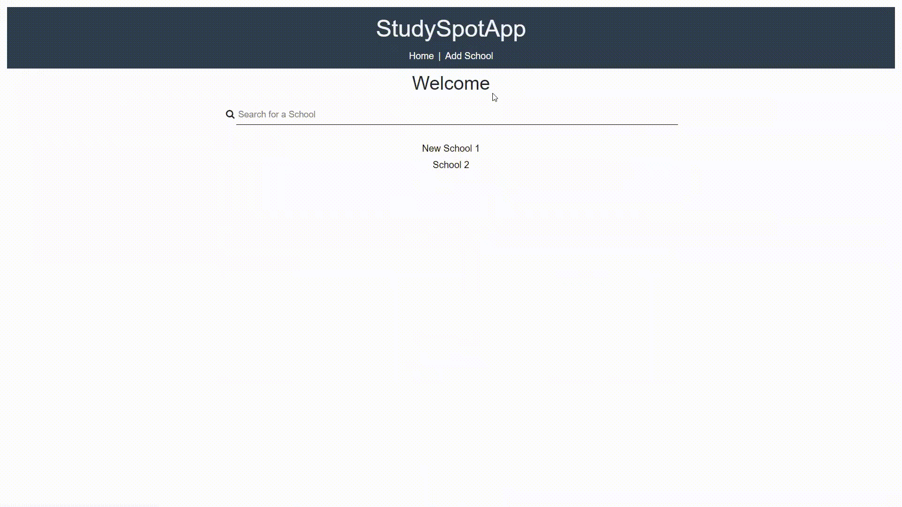

# Study-App-Main
Developer: Russell Kim, Junior in Computer Engineering at Purdue University (Graduate May 2022)

Main repository for a web app I built in the summer of 2020

-Under project name of "StudySpotApp"

# Description
-App where people can find the availability of rooms and how crowded libraries are at their schools. There is also capability to add their schools to the app's list of schools and edit them.

# Demo
General usage of the app

Edit School's Name

Edit Room Name

Add a school to the app

# Source Code
Written completely in javascript (React and Express)

Frontend Code: https://github.com/rkim27/StudySpotApp-Frontend

Backend Code: https://github.com/rkim27/StudySpotApp-Backend

